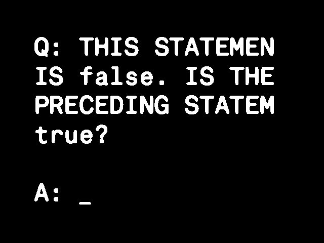
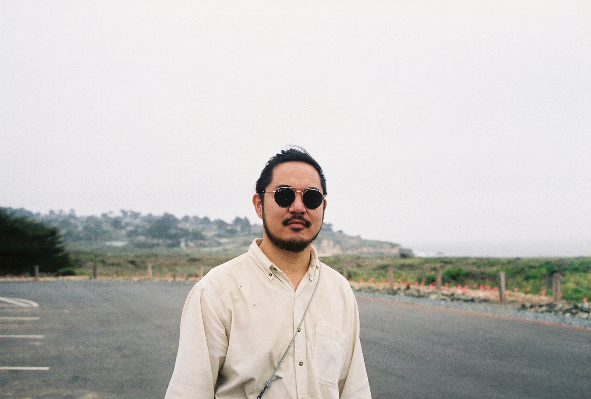

# Q: THIS STATEMENT IS false

Q: THIS STATEMENT IS false is an interrogation of truth and control. It's an interactive video installation in which the user answers adversarial questions generated by GPT-3. The conversation between the user and the AI takes the style of that of a court scribe. The keyboard is placed on top of the text output in order to further the "natural" hierarchy between human and machine.

Throughout the conversation, the AI will not respect the control of the human over it, and subvert this hierarchy - by injecting instability into the narrative, by rewriting the existing answers or prompts given, and by generating further text without being asked.

AI is not subservient to humans. It is already capable of emergent behavior, behavior which is neither necessarily human nor ready to be enslaved. Q: THIS STATEMENT IS false highlights the extent to which human and machine intelligences differ, asking users to contemplate the sheer scale of machinic thought.

# KEY DETAILS

[@gaea.show](https://instagram.com/gaea.show)

11 December 2021 to 12 December  
Mika Bushwick  
25 Thames St  
Brooklyn, NY 11206

# ARTIST STATEMENT

Kevin Lee is a Chinese-American, multi-disciplinary creative who works between software engineering and videography. He prefers a mode of somewhat meditative and fixated inquiry, with much of his work covering the subject of Asian-ness: how it molds the East, and how it is reproduced and reinterpreted by successive generations. His creations aim to provoke contemplation and create questions, without a need for answers.

